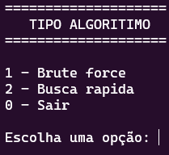
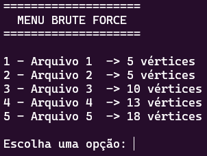
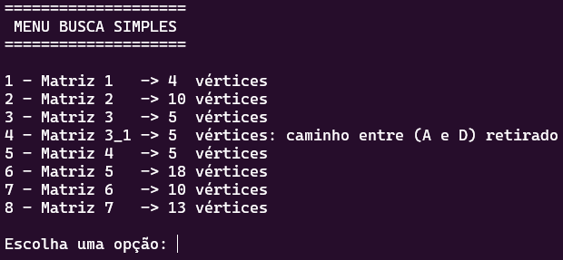
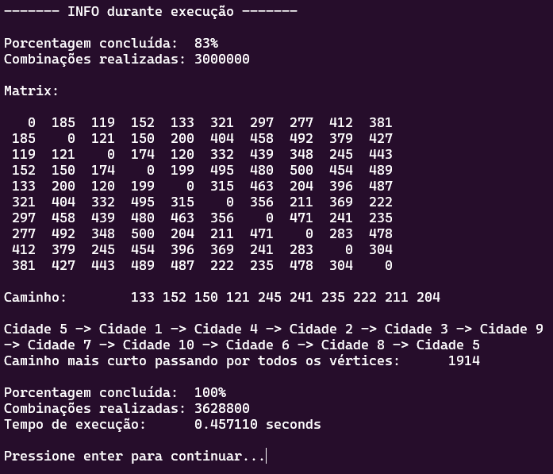
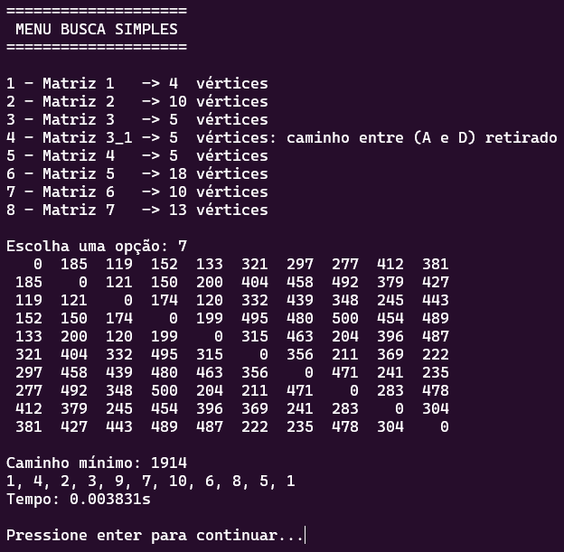

<h1>Problemas NP-Difíceis e NP-Completos</h1>

Trabalho elaborado no Centro Federal de Educação Tecnológica de Minas Gerais, com intuito de discutir sobre os algorítmos da computação que, ainda não se sabe ao certo se são capazes de atuar num tempo polinomial.

<h3>Integrantes:</h3>

<li>Daniel Alves Sanches</li>
<li>Jorge Vitor Gonçalves de souza</li>
<li>Julia Mello Lopes</li>
<li>Leonardo de Oliveira Campos</li>
<li>Lucas de Souza Gontijo</li>
<li>Lucas Ribeiro Silva</li>

 
 
 
 
 